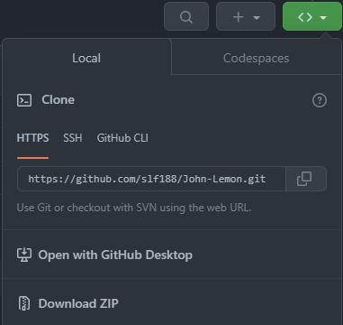

# Post Limon
## Descripción
Post Limon es un proyecto final para la asignatura de Programación Estructurada y Funcional, en donde se aplican los conceptos vistos en la asignatura en un juego hecho completamente en el Motor Gráfico [Unity](https://unity.com/).

## Objetivo del proyecto
- Ganar confianza en el uso del Editor de Unity.
- Explorar los conceptos básicos del desarrollo de juegos en Unity.
- Crear un juego desde el GameObject hasta la construcción final.
- Escribir código personalizado para mejorar el juego.
- Considerar y mejorar la experiencia del usuario en todo momento.

## Herramientas utilizadas
- [DuckDuckGo](https://duckduckgo.com/)
- [VSCode](https://code.visualstudio.com/)
- [Git](https://git-scm.com/)
- [GitHub CLI](https://cli.github.com/)
- [GitHub](https://github.com/)
- [iMovie](https://www.apple.com/imovie/)
- [Unix](https://en.wikipedia.org/wiki/Unix)
- [Neovim](https://neovim.io/)
- [Markdown All in One](https://markdown-all-in-one.github.io/docs/guide/#features)
- [WebGL](https://get.webgl.org/)
- [Unity Play](https://play.unity.com/)
- [Unity Hub](https://unity.com/unity-hub)
- [Unity Platform](https://unity.com/products/unity-platform)
## Lenguajes de programación utilizados
- [C#](https://docs.microsoft.com/en-us/dotnet/csharp/)
- [MarkDown](https://www.markdownguide.org/)
- [Shell](https://en.wikipedia.org/wiki/Shell_script)
## Instalación
Para instalar el repositorio se necesita el software Git.

En el terminal de la computadora escribir los siguientes comandos:

```zh
$ ls
$ cd [ubicación deseada en la computadora para ubicar la carpeta]
$ git init
$ git clone [el codigo HTTPS del repositorio]
```
En caso de que no se disponga de Git en la computadora se puede instalar el repositorio en forma de zip, presionando en donde dice "Download ZIP".



## Uso
Para utilizar el juego es necesario tener WebGL en la computadora, entrar al siguiente link para jugar el juego:

[Post Limon](https://play.unity.com/p/webgl-605/edit)


## Referencias
- [Stack Overflow](https://stackoverflow.com/)
- [Unity User Manual](https://docs.unity3d.com/Manual/index.html)
- [Unity C# Reference](https://github.com/Unity-Technologies/UnityCsReference)
- [Unity Documentation](https://docs.unity.com/)
- [Unity Answers](https://answers.unity.com/index.html)
## Video
El video se puede encontrar en YouTube en el siguiente link:
## Licencia
[MIT](https://choosealicense.com/licenses/mit/)

## Autor
[Felipe Vallejo](https://www.linkedin.com/in/felipe-vallejo-200188/)

